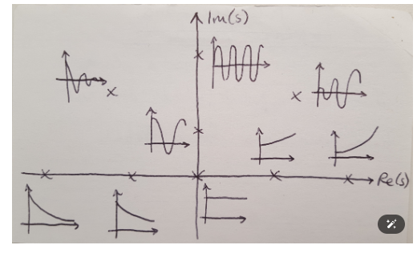
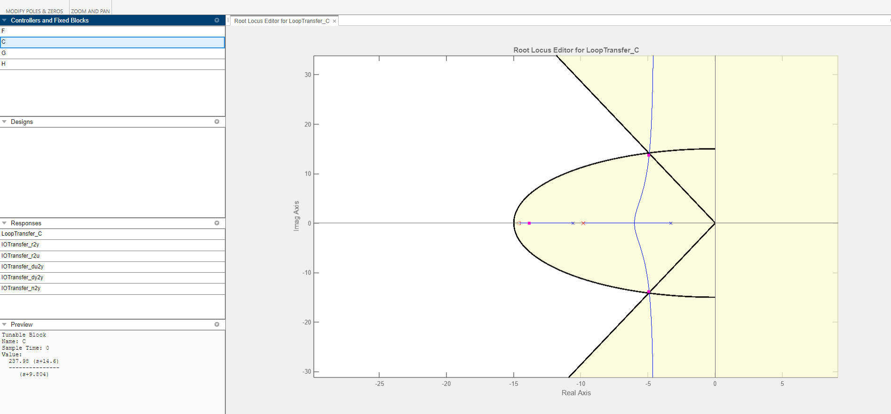

# INTRODUCTION

## Root Locus Analysis

Root locus analysis is a powerful graphical technique in control theory and stability analysis. It provides insights into how a system's behavior changes as a key parameter (typically a gain) is adjusted.

### Key Concepts

1. **Definition**: Root locus plots the movement of a system's closed-loop poles in the complex s-plane as a function of a variable parameter.

2. **Origin**: Developed by Walter R. Evans in the 1940s, it has become a fundamental tool in classical control theory.

3. **Purpose**: 
   - Assess system stability
   - Visualize the effect of gain changes on system dynamics
   - Aid in controller design and tuning

4. **Representation**: The plot shows how poles (roots of the characteristic equation) move in the complex plane as a parameter varies.

5. **Stability Criterion**: The system's stability can be determined by observing whether the poles remain in the left half of the s-plane.

### Applications

- Feedback control system design
- Gain selection for desired system response
- Analysis of system sensitivity to parameter changes

Root locus analysis bridges the gap between time-domain and frequency-domain techniques, offering valuable insights into system behavior and facilitating effective controller design.

### TRANSFER FUNCTION

We have 2 models for the transfer function of localised regions of a non-linear system. (Probably add a picture of what I mean of add  a seperate readme describing this).

**Continuous-time ARMAX model:** 

$$
A(s)y(t) = B(s)u(t) + C(s)e(t)
$$

- A(s) = s² + 13.87s + 34.91
- B(s) = 0.080631s + 0.7555
- C(s) = s² + 136.4s + 2023

$$
\frac{Y(s)}{U(s)} = \frac{0.7555}{s² + 13.87s + 34.91}
$$

**Continuous-time BJ model:** 

$$
y(t) = [B(s)/F(s)]u(t) + [C(s)/D(s)]e(t)
$$

- B(s) = 0.806622s + 0.6979
- C(s) = s³ + 323.6s² + 1.382e05s + 1.252e07
- D(s) = s³ + 204.5s² + 1.893e05s + 1.087e05
- F(s) = s² + 12.23s + 35.01

$$
\frac{Y(s)}{U(s)} = \frac{0.6979}{s² + 12.23s + 35.01}
$$

### SYSTEMS ROOT LOCUS PLOT
 This can be obtained by hand drawing as described in Various texts (Modern Control Theory Ogata (highly recommended reading in order to have an intuition of what is going on)), running a python script or a matlab script as below.

 **Continous-time Armax model**

 ```matlab
num_armax = [0.755];
den_armax = [1 13.87 34.91];
tf_t = tf( num_armax, den_armax)
pole(tf_t)
tf_t_closed = feedback( tf_t, 1)
pole(tf_t_closed)
rlocus( tf_t, 'b', tf_t_closed, 'r')
hold on
legend('sys','sys closed')
hold off
 ```


**Continous-time BJ model**

```matlab
num_BJ = [0.6979];
den_BJ = [1 12.23 35.01];
tf_BJ = tf( num_BJ, den_BJ)
pole(tf_BJ)
tf_BJ_closed = feedback( tf_BJ, 1)
pole(tf_BJ_closed)
rlocus(tf_BJ);rlocus( tf_BJ, 'b', tf_BJ_closed, 'r')
hold on
legend('sys','sys closed')
hold off
```


### WHAT DO THE DIAGRAMS TELL US
1. **STABILITY**

 

Since our poles are on the left of the imaginary axis it means that out transfer functions are stable, meaning the system is stable over the localised region represented by the transfer function. The distance from the imaginary axis can be used to tell us further information about the system. This also talks about the effect of gain on the system, for our systems not value of K can make the system unstable, since the poles always remain on the left of the imaginary axis. This feature is important especially for condtionally stable systems as illustarted below:


 2. **Constant Looci $\zeta$ and Constant $w_n$**

The damping ratio determines the angular location of the poles, while the distance of the pole from the origin is determined by the undamped natural frequency $w_n$


To overlay this on matlab for our system we use the following matlab command:

```matlab
sgrid
```
The result for the armax model is:


The result for th BJ model is:


Frow this we can approximate the two values.

3. **Other response characteristics**


1. Settling time:

This would be a line parallel to the imaginary axis calculated as:

$$t_s = \frac{4}{\zeta w_n}$$

The further it is to the left the fast the system settles.
To have this on we can use the control design app, this will look as follows:


2. Percentaga overshoot:

This is a cone which the poles must be within to be under a certain overshoot threshold. The overshoot is calculated as:

$$M_p = e^-{\frac{\zeta}{\sqrt{1-(\zeta)^2}}\pi}$$

On the control systems app, this is visualised as:


## ROOT LOCUS APPROACH TO CONTROL-SYSTEMS DESIGN.

The design by the root-locus method is based on reshaping the root locus of the system by adding poles and zeros to the system’s open-loop transfer function and forcing the root loci to pass through desired closed-loop poles in the s plane.The characteristic of the root-locus design is its being based on the assumption that the closed-loop system has a pair of dominant closed-loop poles.This means that the effects of zeros and additional poles do not affect the response characteristics very much.  This is done by compensation. There are of two types, parallel and series, here we handle only series compensators.

These added poles and zeros affect the system in the following ways:

**Poles** The addition of a pole to the open-loop transfer function has the effect of pulling the root locus to the right, tending to lower the system’s relative stability and to slow down the settling of the response.

**Zeros** The addition of a zero to the open-loop transfer function has the effect of pulling the root locus to the left, tending to make the system more stable and to speed up the settling of the response.


### lead compensation

The root-locus approach to design is very powerful when the specifications are given in terms of time-domain quantities, such as the damping ratio and undamped natural frequency of the desired dominant closed-loop poles, maximum overshoot, rise time, and settling time.

Consider a design problem in which the original system either is unstable for all values of gain or is stable but has undesirable transient-response characteristics. In such a case, the reshaping of the root locus is necessary in the broad neighborhood of the jv axis and the origin in order that the dominant closed-loop poles be at desired locations
in the complex plane.This problem may be solved by inserting an appropriate lead compensator in cascade with the feedforward transfer function.

For our system the $w_n$, $\zeta$, overshoot and settling time can be obtained as follows:

```matlab
[ wn, z] = damp(tf_t_closed)
stepinfo(tf_t_closed)
```
For our armax model, we have 

$$T_r = 0.6991$$
$$T_s = 1.2631$$
$$overshoot = 0$$
$$\zeta = 1$$
$$w_n = 3.4095, 10.4605$$

For practice let us give desired values of

$$w_n = 15$$
$$T_s = 0.8$$

From the above equation of $T_s$ out damping ratio becomes:

$$\zeta = 0.33$$

Graphically the requirement is as displaed below:


The poles are supposed to be moved to the intersection point of the circle and cone above, as an equation thos points are:

$$s^2 + 2\zeta w_n s + w_n^2 = s^2 + 2*0.33*15 s + 15^2$$

$$s^2 + 9.9s + 225$$

$$s = -4.95 \pm 14.1597i$$

This is acheived by adding a pole and a zero with some gain K, the easiest way to achieve this is by the matlab control system designer app, though methods exist as shown by Katashiko Ogata:

Here we use the control system designer:
[[watch video]](https://www.youtube.com/watch?v=6K8ziy83WJI&ab_channel=KevinKipkorir)

The result will look as follows:


The lead compensator resulting is:
$$237.98\frac{s + 14.6}{s + 9.804}$$

To add this to the system and chec the final root locus we can run the following code:

```matlab
K_controller = 237.98;
num_controller = [1 14.6];
den_controller = [1 9.804];

G_c = tf( K_controller*num_controller, den_controller)
Gc_tf = series( G_c, tf_t)
full_tf = feedback(Gc_tf, 1)
rlocus(full_tf)
```

The flow chart of the system is now as shown in the below picture.


From the root locus above we can seee that the closed loop poles are at the desired locations. The Characteristics we desired to alter are now at:

$$w_n = 14.6432$$
$$T_s = 0.7571$$

And zeta is at:

$$\zeta = 0.3361$$

So we have acheived a good controller, now onto how to make it run the physical system that the transfer function presents.

## MOTOR VELOCITY CAONTROL

TODO: Write on the motor hardware or like to where the hardware is presented, I have not placed it here since it is too deep and will then have to place it in every file after this.

First we take the controller from continous time to discreete time (S to Z domain)' this can be done easily by running the c2d command on matlab

```matlab
Ts = 0.01;%%sampling period making a sampling rate of 100Hz
c2d( G_c, Ts,"zoh")
```
The reulstant equation is:
$$\frac{Y(z)}{U(z)}= \frac{238z - 204.9}{z - 0.9066}$$

Now to put it in a more conducive form for use in embedded systems;

$$zy(z) - 0.9066y(z) = 238zu(z) -204.9u(z)$$

Dividing through by z;

$$y(z) - 0.9066*y(z)*z^{-1} = 238*u(z) - 204.34*u(z)*z^{-1}$$

Making y(z) the subject of the formulae;

$$y(z) = 0.9066*z^{-1} + 238*u(z) - 204.34*y(z)*z^{-1}$$

$z^{-1}$ can be represented as the previous input, thus the system can be rewritten as;

$$y[k] = 0.9066*y[k-1] + 238*u[k] - 204.34*u[k-1]$$

This is can be written the following way in arduino:
```arduino
//G_C COMPENSATOR INITIALISATION
double G_c_output[2] = { 0.00, 0.9066};
double G_c_input[2] = { 238, -204.34};

//THE INPUT OUPTU DATA
double u_gc[3] = { 0.0, 0.0, 0.0};
double y_gc[3] = { 0.0, 0.0, 0.0};
```

In the loop function the controller is solved as:

```arduino
     //GC_Controller   
     //double G_c_output[2] = { 0.00, 0.9066};
     //double G_c_input[2] = { 238, -204.34};
     u_gc[0] = error;
     y_gc[1] = y_gc[0];
     y_gc[0] = G_c_output[1]*y_gc[1] + G_c_input[0]*u_gc[0] + G_c_input[1]*u_gc[1];
     u_gc[1] = u_gc[0];
    
     int feed = (int)y_gc[0];
     ledcWrite(0, feed);
     if(255 > 0)
        {
           digitalWrite(IN1, HIGH);
           digitalWrite(IN2, LOW);
        }
     else if(255 < 0)
        {
           digitalWrite(IN2, HIGH);
           digitalWrite(IN1, LOW);
        }
```
The results are here are the video results for an attempt at motor control:


The blue line is the reference while the orange line is the output data, the reference input is from a potentiometer which explains the noise,this could be solved by using digital filters but for our system it will not be a major problem, we notice that the system approaches the reference the slopes away, this maintains a constant oscillations. This could be:
1. due to the nature of the real motor being non-linear as a whole and was represented by  linear system model which is supposed to be used for a small localised region.
2. Lack of an intergrator to get it to zero steady state.

<video controls src="ROOT LOCUS.mp4" title="Title"></video>

Despite the lead compensator not having worked perfectly we now have the basics of how to design and implement one properly on discrete time systems.


[^1]: Should I elaborate on the specific implications of root locus analysis for the current system under consideration? This could include how the poles move for our particular transfer function and what this means for the system's stability and performance as the gain changes.
[^2]: The model is so that the input of the system is the PWM and the output is velocity.