# PID CONTROLLERS AND MODIFIED PID CONTROLLERS
## INTRODUCTION

A Proportional-Integral-Derivative (PID) controller is one of the most widely used control algorithms in engineering and industrial applications, prized for its simplicity and effectiveness in managing dynamic systems. At its core, a PID controller aims to minimize the error between a system's desired output and its actual output by continuously adjusting control inputs based on three key terms: Proportional (P), Integral (I), and Derivative (D).

Because most PID controllers are adjusted on-site, various tuning methods have been developed to ensure that these controllers perform optimally across a wide range of systems and conditions. The flexibility of PID control allows for precise adjustments in real-time, adapting to the specific requirements of each application. Numerous tuning rules, such as the Ziegler-Nichols or Cohen-Coon methods, have been proposed in the literature to guide engineers in fine-tuning PID parameters. These tuning methods provide a structured approach for setting gains, either manually or through automated tuning algorithms embedded in modern controllers.

Some PID controllers now incorporate automatic tuning features that allow for real-time parameter adjustment. This capability enables seamless adaptation to changing conditions, which is particularly useful in applications with variable dynamics. Additionally, modified forms of PID control, such as I-PD and multi-degree-of-freedom PID controllers, have been developed to provide even greater flexibility and control accuracy in industrial applications.

Practical strategies, such as bumpless transfer from manual to automatic operation and gain scheduling for systems with variable operating points, have also been widely adopted. These advancements extend PID’s effectiveness in scenarios where model-based design is impractical or impossible due to unknown or complex system dynamics.

The general applicability of PID controllers has made them a cornerstone in control engineering, especially in fields like process control, where exact mathematical models of plants are often unavailable. Here, basic and modified PID schemes have shown their reliability in delivering satisfactory control across diverse applications, even when they may not achieve absolute optimality.

## MOTOR MODEL TO BE USED FOR THE DEMONSTRATION


$$
\frac{Y(s)}{U(s)} = \frac{0.7555}{s² + 13.87s + 34.91}
$$

## ZEIGLER-NICHOLS RULES FOR TUNING PID CONTROLLERS

### FIRST METHOD

This method involves the use of the response of the plant to a unit step, the method applies only if the system step response has an s-curve shape. The shape is described by two constants the delay and the time constant T. They are know by drawing a tangent line with th inflection point as show below.
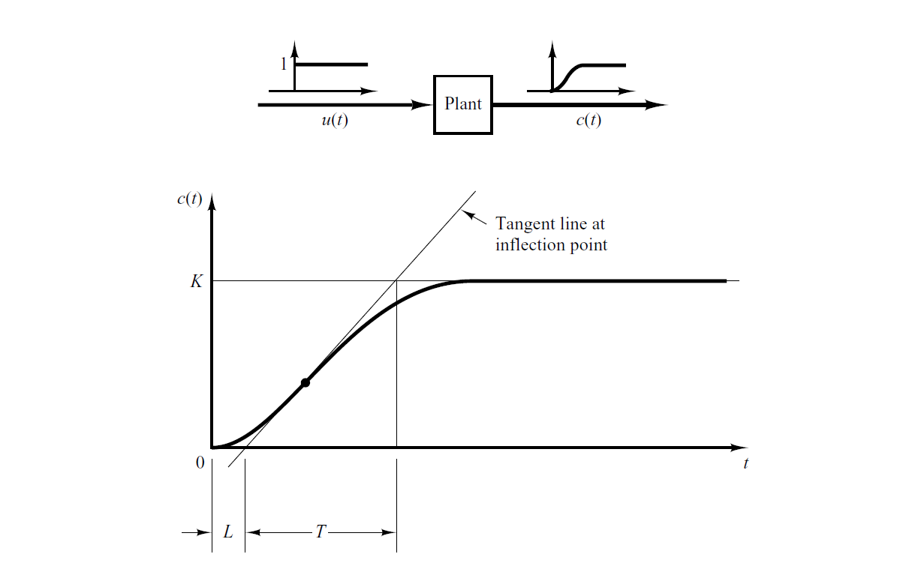

the point the line crosses the x-axis to the 0, is know as the delay time L The time the system takes to cross the point c(t) = K is the time constant. We then use the table below to calculate the PId coefficients:
| Type of Controller | \( $K_p$ \)     | \( $T_i$ \)        | \( $T_d$ \)    |
|--------------------|-----------------|--------------------|----------------|
| P                  |$\frac{T}{L}$    | $\infty$           |   $0$          |
| PI             | $0.96\frac{T}{L}$   | $\frac{L}{0.3}$    |   $0$          |
| PID                |$1.2\frac{T}{L}$ | $L$                |   $0.5L$       |


Given our system we can estimate it by a simple arduino sketch:

```arduino
//OBTAINING THE DATA FEEDBACK
    //filtering the data 
    double yn = 0.969 * yn_1 + 0.0155 * velocity + 0.0155 * xn_1;
    xn_1 = velocity;
    yn_1 = yn;

    //velocity time
    current_position = ((float)encoderCount / 500) * 3.147;
    velocity = (current_position - radians_)/(0.01);   
    radians_ = current_position; 
    
      int feed = 150;//random K value
      ledcWrite(0, feed);
        if(255 > 0)
        {
           digitalWrite(IN1, HIGH);
           digitalWrite(IN2, LOW);
        }
        else if(255 < 0)
        {
           digitalWrite(IN2, HIGH);
           digitalWrite(IN1, LOW);
        }
    

    Serial.println(yn);

    delay(10);
```
Basically what we do is give the system a certain PWM value and monitor the output velocity value. From the output data, we can graph that, for our system the data is as follows:

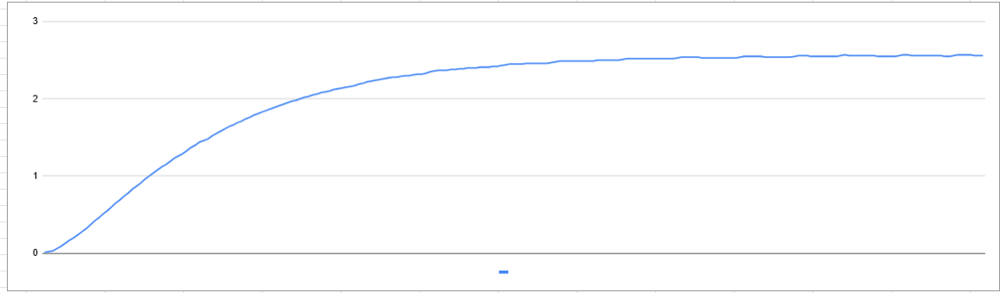

The data output file is linked below:

[OUTPUT DATA](../extra_files/ARDUINO_SCRIPTS/PID_zeigler_nichols_method_1/Zeigler_nichols_method_1.xlsx)

Each data point is collected every 0.01 seconds. After drawing th tanget line we greater

$$ L \approx 0.07s $$

$$ T \approx 0.36s $$

The PID coefficients are therefor

**Proportional Control**

$$k_P = \frac{0.36}{0.07}$$

$$T_i = \infty$$

$$T_d = 0$$

**Proportional Integral Control**

$$k_P = 0.9*\frac{0.36}{0.07}$$

$$T_i = \frac{0.07}{0.3}$$

$$T_d = 0$$

**Proportional Integral Derivative Control**

$$k_P = 1.2*\frac{0.36}{0.07}$$

$$T_i = 2*0.07$$

$$T_d = 0.5*0.07$$

The control loop is:


The $\infty$ is in practice a large number. To represent this in Cpp for arduino we have to convert the continuous time system to discrete time we can use matlab for this:

```matlab
T = 0.36;
L = 0.07;

K_p = (T/L); 
T_i = 1000000; 
T_d = 0;

num = [K_p*T_d*T_i  K_p*T_i K_p];
den = [T_i 0];
fs = 100;%%meaning after every 10ms

tf_t = tf( num, den)

sample_time = 0.01;
tf_d = c2d(tf_t, sample_time, 'tustin')
K_p = 0.9*(T/L); 
T_i = (L/0.3); 
T_d = 0;

num = [K_p*T_d*T_i  K_p*T_i K_p];
den = [T_i 0];
fs = 100;%%meaning after every 10ms

tf_t = tf( num, den);

sample_time = 0.01;
tf_d = c2d(tf_t, sample_time, 'tustin')
K_p = 1.2*(T/L); 
T_i = (L); 
T_d = 0.5*L;

num = [K_p*T_d*T_i  K_p*T_i K_p];
den = [T_i 0];
fs = 100;%%meaning after every 10ms

tf_t = tf( num, den);

sample_time = 0.01;
tf_d = c2d(tf_t, sample_time, 'tustin')
```

Ther results we get from these are:

For P:

$$\frac{5.143*z - 5.143}{z-1} $$

For PI:

$$\frac{4.728*z-4.529}{z-1}$$

For PID:

$$\frac{49.81*z^{2}-85.52*z+37.47}{z^{2}-1}$$

After transformation we get:

$$y[k] = y[k-2]+49.81*u[k]-85.52*u[k-1]+37.47*u[k-2]$$

For P:

$$y[k] = y[k-1]+5.143*u[k]-5.143*u[k-1]$$

For PI:

$$y[k] = y[k-1]+4.728*u[k]-4.529*u[k-1]$$

For PID:

$$y[k] = y[k-2]+49.81*u[k]-85.52*u[k-1]+37.47*u[k-2]$$

#### ARDUINO IMPLEMENTATIONS
**FOR THE P CONTROLLER**

```arduino
//DATA STORAGE
double controller_input[3] = { 0.0, 0.0, 0.0};//u[k], u[k-1], u[k-2]
double controller_output[3] = { 0.0, 0.0, 0.0};//y[k], y[k-1], y[k-2]

//coefficient storage
double output_coeffs[2] = { 1.0, 1.0};//output coeffs y[k], y[k-1]
double input_coeffs[2] = { 5.143, -5.143};//input coeffs, u[], u[k-1]
```

In the for loop the controller is implemented as:

```arduino
    //computing the error
    double ref = 2.5;
    double error = ref - yn;


    //computing the controller values
    //replacing the values
    controller_input[0] = error;
    controller_output[0] = controller_output[1] + input_coeffs[0]*controller_input[0] + input_coeffs[1]*controller_input[1];
    controller_input[1] = controller_input[0];
    controller_output[1] = controller_output[0];
```

The gain did not even budge it from zero.

**FOR THE PI CONTROLLER**

```arduino
//DATA STORAGE
double controller_input[3] = { 0.0, 0.0, 0.0};//u[k], u[k-1], u[k-2]
double controller_output[3] = { 0.0, 0.0, 0.0};//y[k], y[k-1], y[k-2]

//coefficient storage
double output_coeffs[2] = { 1.0, 1.0};//output coeffs y[k], y[k-1]
double input_coeffs[2] = { 4.728, -4.529};//input coeffs, u[k], u[k-1]
```


In the loop the controller is implemented as:

```arduino
    //computing the error
    double ref = 2.5;
    double error = ref - yn;


    //computing the controller values
    //replacing the values
    controller_input[0] = error;
    controller_output[0] =  output_coeffs[1]*controller_output[1] + input_coeffs[0]*controller_input[0] + input_coeffs[1]*controller_input[1];
    controller_input[1] = controller_input[0];
    controller_output[1] = controller_output[0];
```

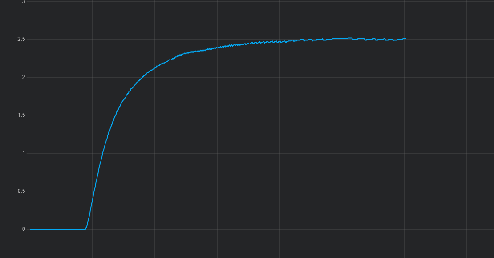


**FOR THE PID CONTROLLER**

For the initialization

```arduino
//DATA STORAGE
double controller_input[3] = { 0.0, 0.0, 0.0};//u[k], u[k-1], u[k-2]
double controller_output[3] = { 0.0, 0.0, 0.0};//y[k], y[k-1], y[k-2]

//coefficient storage
double output_coeffs[3] = { 1.0, 0.0, 1.0};//output coeffs y[k], y[k-1], y[k-2]
double input_coeffs[3] = { 49.81, -85.52, 37.47};//input coeffs, u[k], u[k-1], u[k-2]
```
The loop is implemented as follows:

```arduino
    //replacing the values
    //computing the error
    double ref = 2.5;
    double error = ref - yn;

    controller_input[0] = error;
    controller_output[0] =  output_coeffs[1]*controller_output[1] + output_coeffs[2]*controller_output[2] + input_coeffs[0]*controller_input[0] + input_coeffs[1]*controller_input[1] +  input_coeffs[2]*controller_input[2];
    controller_input[2] = controller_input[1];
    controller_input[1] = controller_input[0];
    controller_output[2] = controller_output[1];
    controller_output[1] = controller_output[0];
```

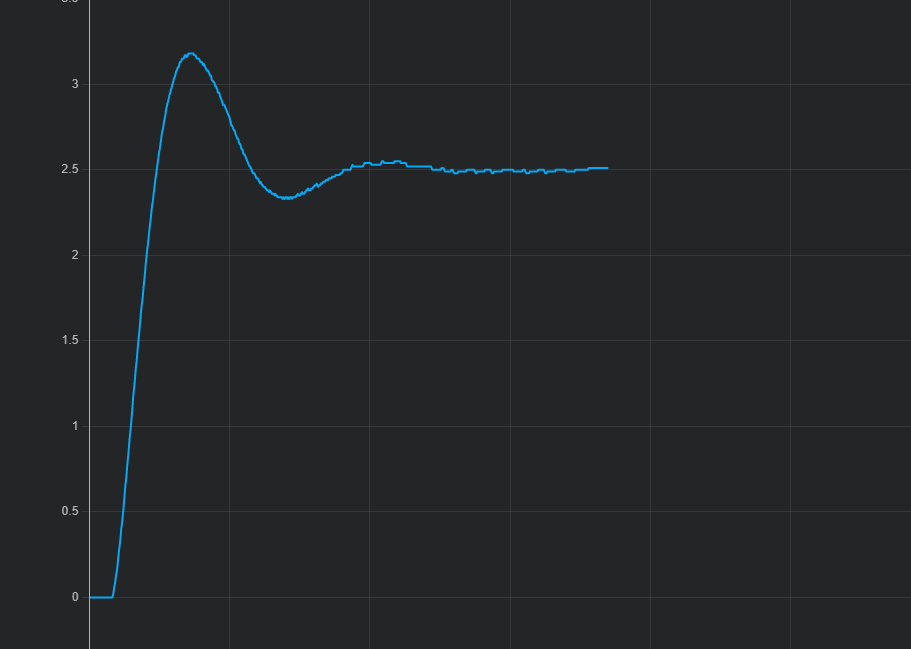

### SECOND METHOD
In the second method, we first set $T_i$ = $\infty$ and $T_i$ = 0. Using the proportional control action only, increase Kp from 0 to a critical value $K_{cr}$ at which the output first exhibits sustained oscillations. Thus, the critical gain $K_{cr}$ and the correspondind period $P_{cr}$ are experimantally determined.

The flow chart will be something like this:


Here is a visual representation of how the period and appear as follows:

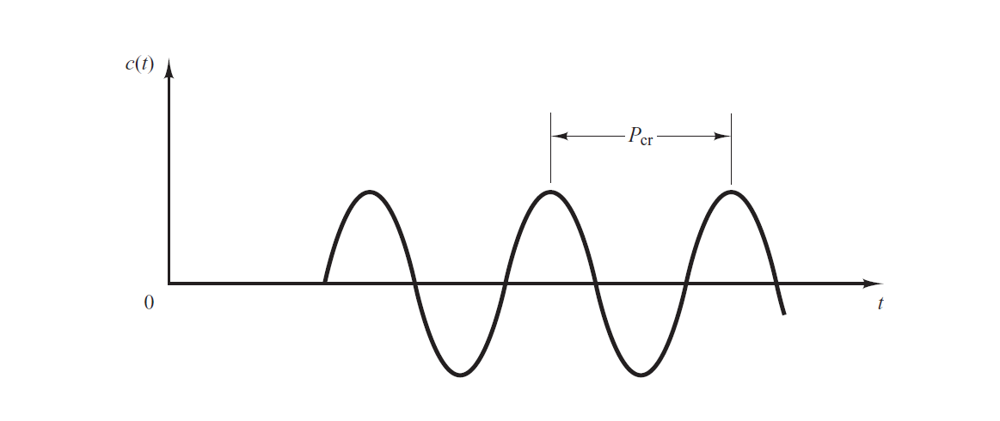

After obtaining gain ($K_{p}$) and the P_{cr}. After this we use the following table:


| Type of Controller | \( $K_p$ \)     | \( $T_i$ \)        | \( $T_d$ \)    |
|--------------------|-----------------|--------------------|----------------|
| P                  |0.5*$K_{cr}$    | $\infty$           |   $0$          |
| PI             | 0.45*$K_{cr}$   | $\frac{1}{1.2}$$P_{cr}$    |   $0$          |
| PID                |0.6*$K_{cr}$ | 0.5*$P_{cr}$                |   0.125*$P_{cr}$       |


#### EXPERIMENTALLY DETERMINING THE $P_{cr}$

We use a potentiometer to increase the value of $K$ until we find the $K_{cr}$:

**ARDUINO**

The setup will be:

```arduino
//DATA STORAGE
double controller_input[3] = { 0.0, 0.0, 0.0};//u[k], u[k-1], u[k-2]
double controller_output[3] = { 0.0, 0.0, 0.0};//y[k], y[k-1], y[k-2]

//coefficient storage
double output_coeffs[3] = { 1.0, 0.0, 0.0};//output coeffs y[k], y[k-1]
double input_coeffs[3] = { 1000.0, 0.0, 0.0};//input coeffs, u[], u[k-1]
```
Then the loop would be

```arduino
   //computing the controller values
    //replacing the values
    //computing the error
    double ref = 2.5;
    double error = ref - yn;
    
    //computing the controller values
    //replacing the values
    controller_input[0] = error;
    controller_output[0] = input_coeffs[0]*controller_input[0];
```

After working with K, we get the 

$$K_{cr} \approx 1000 $$

The output looks as follows:

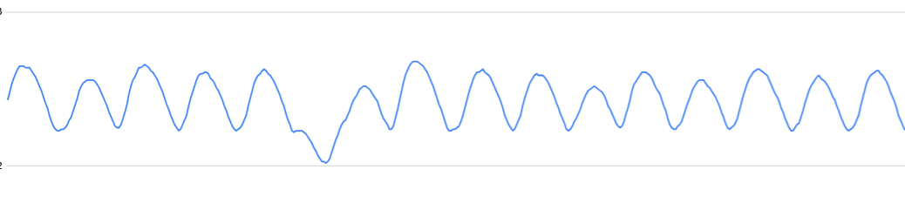

The time from crest to crest is:

$$P_{cr} \approx 0.37 $$

The P, PI and PID coefficients are:

**Proportional Control**

$$k_P = 0.5*1000$$

$$T_i = \infty$$

$$T_d = 0$$

**Proportional Integral Control**

$$k_P = 0.45*1000$$

$$T_i = \frac{1}{1.2}*0.37$$

$$T_d = 0$$

**Proportional Integral Derivative Control**

$$k_P = 0.6*1000$$

$$T_i = 0.5*0.37$$

$$T_d = 0.125*0.37$$

To represent this in arduino we have to convert it to the discrete time domain:

```matlab
K_cr = 1000;
P_cr = 0.37;

K_p = (0.5*K_cr); 
T_i = 1000000; 
T_d = 0;

num = [K_p*T_d*T_i  K_p*T_i K_p];
den = [T_i 0];

tf_t = tf( num, den);

sample_time = 0.01;
tf_d = c2d(tf_t, sample_time, 'tustin')
K_p = 0.45*(K_cr); 
T_i = (1/1.2)*(P_cr); 
T_d = 0;

num = [K_p*T_d*T_i  K_p*T_i K_p];
den = [T_i 0];
fs = 100;%%meaning after every 10ms

tf_t = tf( num, den);

sample_time = 0.01;
tf_d = c2d(tf_t, sample_time, 'tustin')
K_p = 0.6*(K_cr); 
T_i = 0.5*P_cr; 
T_d = 0.125*P_cr;

num = [K_p*T_d*T_i  K_p*T_i K_p];
den = [T_i 0];
fs = 100;%%meaning after every 10ms

tf_t = tf( num, den);

sample_time = 0.01;
tf_d = c2d(tf_t, sample_time, 'tustin')
```


Ther results we get from these are:

For P:

$$\frac{500*z - 500}{z-1} $$

For PI:

$$\frac{457.3*z-442.7}{z-1}$$

For PID:

$$\frac{6166*z^{2}-1.107e04*z+4966}{z^{2}-1}$$

After transformation we get:

For P:

$$y[k] = y[k-1]+500*u[k]-500*u[k-1]$$

For PI:

$$y[k] = y[k-1]+457.3*u[k]-442.7*u[k-1]$$

For PID:

$$y[k] = y[k-2]+6166*u[k]-1.107e04*u[k-1]+4966*u[k-2]$$

#### ARDUINO IMPLEMENTATIONS
**FOR THE P CONTROLLER**

```arduino
//DATA STORAGE
double controller_input[3] = { 0.0, 0.0, 0.0};//u[k], u[k-1], u[k-2]
double controller_output[3] = { 0.0, 0.0, 0.0};//y[k], y[k-1], y[k-2]

//coefficient storage
double output_coeffs[2] = { 1.0, 1.0};//output coeffs y[k], y[k-1]
double input_coeffs[2] = { 500.0, -500.0};//input coeffs, u[], u[k-1]
```

In the for loop the controller is implemented as:

```arduino
    //computing the error
    double ref = 2.5;
    double error = ref - yn;

    //computing the controller values
    //replacing the values
    controller_input[0] = error;
    controller_output[0] = controller_output[1] + input_coeffs[0]*controller_input[0] + input_coeffs[1]*controller_input[1];
    controller_input[1] = controller_input[0];
    controller_output[1] = controller_output[0];
```
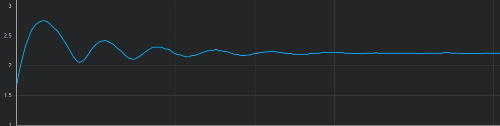

**FOR THE PI CONTROLLER**

```arduino
//DATA STORAGE
double controller_input[3] = { 0.0, 0.0, 0.0};//u[k], u[k-1], u[k-2]
double controller_output[3] = { 0.0, 0.0, 0.0};//y[k], y[k-1], y[k-2]

//coefficient storage
double output_coeffs[2] = { 1.0, 1.0};//output coeffs y[k], y[k-1]
double input_coeffs[2] = { 457.3, -442.7};//input coeffs, u[k], u[k-1]
```


In the loop the controller is implemented as:

```arduino
    //computing the error
    double ref = 2.5;
    double error = ref - yn;

    //computing the controller values
    //replacing the values
    controller_input[0] = error;
    controller_output[0] =  output_coeffs[1]*controller_output[1] + input_coeffs[0]*controller_input[0] + input_coeffs[1]*controller_input[1];
    controller_input[1] = controller_input[0];
    controller_output[1] = controller_output[0];
```

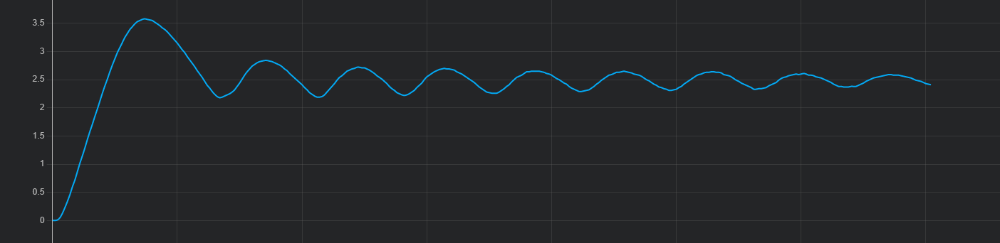

**FOR THE PID CONTROLLER**

For the initialization

```arduino
//DATA STORAGE
double controller_input[3] = { 0.0, 0.0, 0.0};//u[k], u[k-1], u[k-2]
double controller_output[3] = { 0.0, 0.0, 0.0};//y[k], y[k-1], y[k-2]

//coefficient storage
double output_coeffs[3] = { 1.0, 0.0, 1.0};//output coeffs y[k], y[k-1], y[k-2]
double input_coeffs[3] = { 6166, -1.107e04, 4966};//input coeffs, u[k], u[k-1], u[k-2]
```
The loop is implemented as follows:

```arduino
    //replacing the values
    //computing the error
    double ref = 2.5;
    double error = ref - yn;

    controller_input[0] = error;
    controller_output[0] =  output_coeffs[1]*controller_output[1] + output_coeffs[2]*controller_output[2] + input_coeffs[0]*controller_input[0] + input_coeffs[1]*controller_input[1] +  input_coeffs[2]*controller_input[2];
    controller_input[2] = controller_input[1];
    controller_input[1] = controller_input[0];
    controller_output[2] = controller_output[1];
    controller_output[1] = controller_output[0];
```

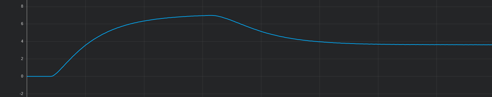

NB: Remember the PD coefficients are just educated guesses, then we will have to tune the coefficients further.


## DESIGN OF PID CONTROLLERS WITH FREQUENCY-RESPONSE APPROACH

In this section we present a design of a PID controller based on the frequency-response approach. This requires us to have a transfer function for the system, this is done by system identification as shown in the system identification section.

The bode diagram below shows how the system behaves:

```matlab
num_c = [0.7555];
den_c = [ 1 13.87 34.91];
tf_t = tf( num_c, den_c);
bode(tf_t)
```
This gives us the bode plot of the system.

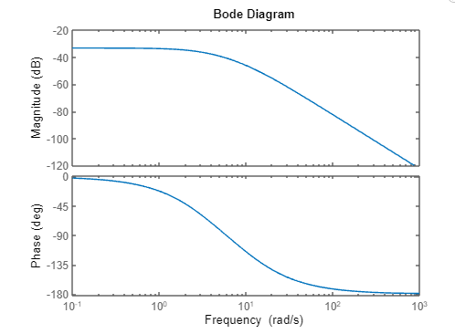

```matlab
% Calculate and display the margins
[GM, PM, Wcg, Wcp] = margin(tf_t)
```
For our system the gain margin and the phase margin are both at $\infty$.
The $K_v$ of the system is:

$$K_p = 0.02163$$ 

$$K_v = \infty$$

$$K_a = \infty$$

Adding a PID controller adds a pole at zero thus making it a type 1 system, let us make the $K_v$ = 4$sec^{-1}$ this can be done by

$$K_v = \lim_{s \to 0}*s*G(c)G(s)$$
$$K_v=\lim_{s \to 0}*K(as+1)(bs+1) * \frac{0.755}{s^2 + 13.87s + 34.91}$$
$$4=\lim_{s \to 0} * K(as+1)(bs+1) * \frac{0.755}{s^2 + 13.87s + 34.91}$$
$$4= (1)(1) * K *\frac{0.755}{34.91}$$
$$K = 184.83$$

```matlab
num_c = [0.7555];
den_c = [ 1 13.87 34.91];
tf_t = tf( num_c, den_c)
```

The controller would be:

```matlab
num_c = [184.83];
den_c = [1 0];
tf_c = tf( num_c, den_c)
tf_full = series( tf_c, tf_t)

%%solving the continous to discrete time
sample_time = 0.01;
tf_d = c2d( tf_c, sample_time, 'tustin')
```
The controller in descrete time is:

$$\frac{Y(s)}{U(s)} = \frac{0.9242z + 0.9242}{z-1}$$

After transformation we get:

$$y[k] = y[k-1] + 0.9242*u[k] + 0.9242*u[-1]$$

The arduino implementation would be.
The setup would be:

```arduino
//DATA STORAGE
double controller_input[3] = { 0.0, 0.0, 0.0};//u[k], u[k-1], u[k-2]
double controller_output[3] = { 0.0, 0.0, 0.0};//y[k], y[k-1], y[k-2]

//coefficient storage
double output_coeffs[2] = { 1.0, 1.0};//output coeffs y[k], y[k-1]
double input_coeffs[2] = { 0.9242, 0.9242};//input coeffs, u[], u[k-1]
```

In the loop we would have:

```arduino
    //computing the error
    double ref = 2.5;
    double error = ref - yn;

    //computing the controller values
    //replacing the values
    controller_input[0] = error;
    controller_output[0] = controller_output[1] + input_coeffs[0]*controller_input[0] + input_coeffs[1]*controller_input[1];
    controller_input[1] = controller_input[0];
    controller_output[1] = controller_output[0];
```
To get the phase margin to 50 degrees or more we can choose $a = 3$, this will reult in the following controller:

```matlab
%%let use move the gain margine to about 50 degrees
num_phase = [3*184.83 1*184.83];
den_phase = [1 0];
tf_phase = tf( num_phase, den_phase)
tf_phase = tf( num_phase, den_phase)
tf_d = c2d( tf_phase, sample_time, 'tustin')

%%To create the closep loop
tf_full = series( tf_phase, tf_t);
tf_full_closed = feedback( tf_full, 1);
% Calculate and display the margins
[GM, PM, Wcg, Wcp] = margin(tf_full_closed)%%At this point the goal is acheived

bode(tf_full_closed)
```
Here is the new bode:

.png)

The phase margin = 57.2501.

The transfer function for the controller is:

$$\frac{Y[z]}{U[z]} = \frac{555.4*z-553.6}{z-1}$$

After transformation we get:

$$y[k] = y[k-1] + 555.4*u[k] - 555.36*u[k-1]$$

The arduino implementation would be.
The setup would be:

```arduino
//DATA STORAGE
double controller_input[3] = { 0.0, 0.0, 0.0};//u[k], u[k-1], u[k-2]
double controller_output[3] = { 0.0, 0.0, 0.0};//y[k], y[k-1], y[k-2]

//coefficient storage
double output_coeffs[2] = { 1.0, 1.0};//output coeffs y[k], y[k-1]
double input_coeffs[2] = { 555.4, -555.36};//input coeffs, u[], u[k-1]
```

In the loop we would have:

```arduino
    //computing the error
    double ref = 2.5;
    double error = ref - yn;

    //computing the controller values
    //replacing the values
    controller_input[0] = error;
    controller_output[0] = controller_output[1] + input_coeffs[0]*controller_input[0] + input_coeffs[1]*controller_input[1];
    controller_input[1] = controller_input[0];
    controller_output[1] = controller_output[0];
```

Since we have already acheived the phase margin to be at least $50\degree$ and the gain margin at $\infty$ we can stop here but we can add the the b = 0.005;

$$K*\frac{(5s+1)(0.005s+1)}{s}$$

$$K*\frac{0.025*s^s + 5.005*s+1}{s}$$

The discrete time transfer function is:

$$\frac{Y[z]}{U[z]} = \frac{1850*z^2 - 1846*z}{z^2 - 1}$$

After the transformation, we get:

$$y[k] = y[k-2] + 1850*u[k] - 1846*u[k-1]$$

The bode plot becomes:

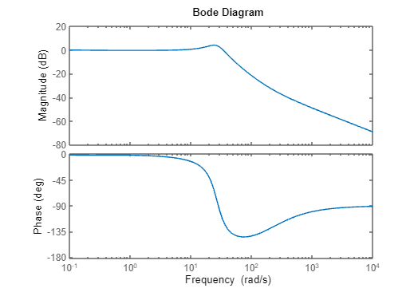

Here we initialize the system. For the initialization

```arduino
//DATA STORAGE
double controller_input[3] = { 0.0, 0.0, 0.0};//u[k], u[k-1], u[k-2]
double controller_output[3] = { 0.0, 0.0, 0.0};//y[k], y[k-1], y[k-2]

//coefficient storage
double output_coeffs[3] = { 1.0, 0.0, 1.0};//output coeffs y[k], y[k-1], y[k-2]
double input_coeffs[3] = { 1850.0, -1846.0, 0.0};//input coeffs, u[k], u[k-1], u[k-2]
```
The loop is implemented as follows:

```arduino
    //replacing the values
    //computing the error
    double ref = 2.5;
    double error = ref - yn;

    controller_input[0] = error;
    controller_output[0] =  output_coeffs[1]*controller_output[1] + output_coeffs[2]*controller_output[2] + input_coeffs[0]*controller_input[0] + input_coeffs[1]*controller_input[1] +  input_coeffs[2]*controller_input[2];
    controller_input[2] = controller_input[1];
    controller_input[1] = controller_input[0];
    controller_output[2] = controller_output[1];
    controller_output[1] = controller_output[0];
```

The output will be:

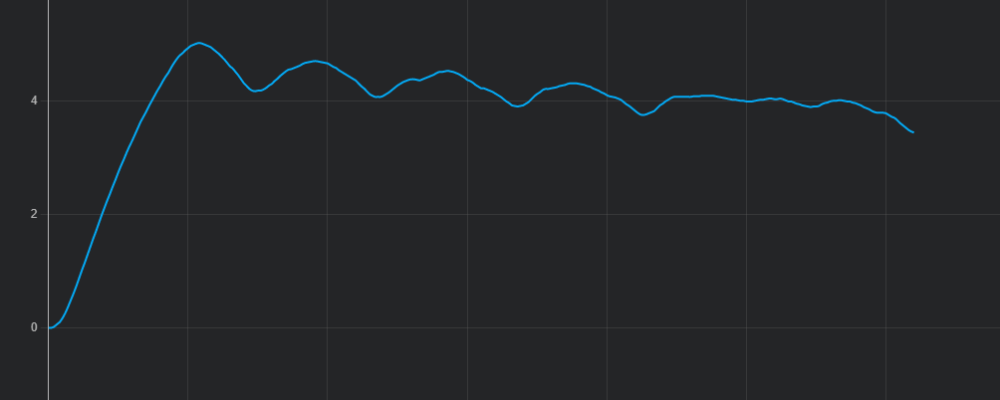

This has made the system unstable thus is not really the best method for this system.

The results on the RLOCUS show that we would have expected this:

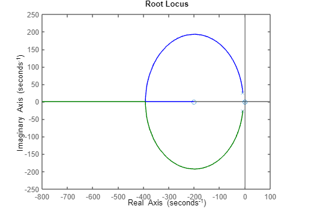

NB: The results do not show how the methods will work for you but how they worked for my system so you may have better or worse results.