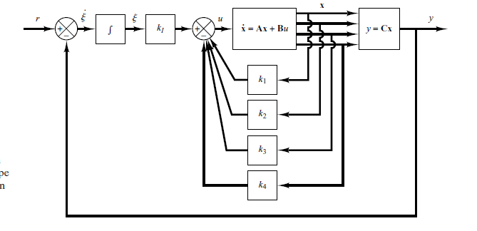
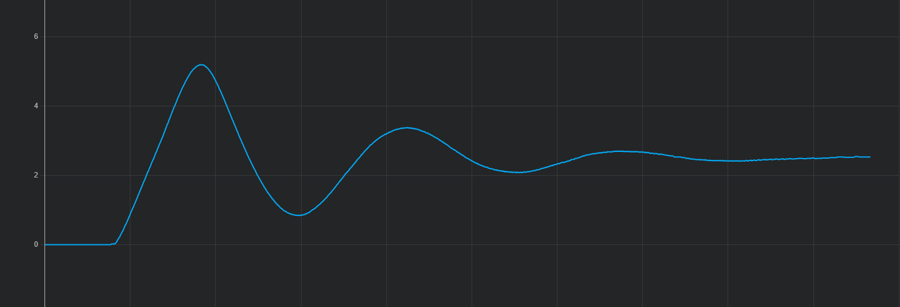

# CONTROL SYSTEMS DESIGN IN STATESPACE
## INTRODUCTION

This document discusses state-space design methods based on the pole-placement method observers, the quadratic optimal and regulator systems.The pole-placement method is somewhat similar to the root-locus method in that we place closed-loop poles at desired locations.The basic difference is that in the root-locus design we place only the dominant closed-loop poles at the desired locations, while in the pole-placement design we place all closed-loop poles at desired locations.

### DESIGN OF SERVO SYSTEMS
#### Design of Type 1 Servo System when the Plant Has No Integrator.

This is th flowchart of the statespace system:



The following matlab script gives how to obtain the the gains:

```matlab
%%DESIGN OF SERVO SYSTEMS
%%Design of Type 1 Servo System when the Plant Has An Integrator.
num = 0.755;
den = [1, 13.87, 34.91];
A = [0        1;
     -34.91  -13.87]

B = [0  ; 0.755]

C = [1 0];


P = [A     B;
     -C    0]
rank(P)%%has rand n+1 thus the system is completely statecontrollable
A_hat = [ A          zeros( 2, 1); 
         -C          0]
B_hat = [B;
         0]
J = [(-2+j*4) (-2-j*4) 1];
Khat = acker( A_hat, B_hat, J)
K = [ Khat(1) Khat(2)]
K_1 = Khat(3)
AA = [A-B*K   B*K_1;
      -C      0]
BB = [ 0; 0; 1]
CC = [0 C]
DD = [0]
rlocus( AA, BB, CC, DD)
sys = ss( AA, BB, CC, DD);
pole( sys)

%***** To obtain response curves x1 versus t, x2 versus t,
% x3 versus t, x4 versus t, and x5 versus t, separately, enter
% the following command *****
t = 0:0.02:6;
[y,x,t] = step(AA,BB,CC,DD,1,t);
x1 = [1 0 0]*x';%%velocity
x2 = [0 1 0]*x';%%acceration
x3 = [0 0 1]*x';%%error
subplot(3,2,1); plot(t,x1); grid
title('x1 versus t')
xlabel('t Sec'); ylabel('x1')
subplot(3,2,2); plot(t,x2); grid
title('x2 versus t')
xlabel('t Sec'); ylabel('x2')
subplot(3,2,3); plot(t,x3); grid
title('x3 versus t')
xlabel('t Sec'); ylabel('x3')
```
The gains obtained above will be:

$$K = -25.0464 \space \space \space \space -14.3974 \space \space \space \space 26.4901$$

The initialization will be:
```arduino
//DATA STORAGE
double state_space[2] = { 0.0, 0.0};
double state_space_total = 0.0;
double gains_[3] = { -25.0464, -14.3974, 26.4901}; 
double error_integral = 0.0;
```

The loop will run as follows:

```arduino
    //replacing the values
    //computing the error
    double ref = 2.5;
    double error = ref - yn;
    state_space[0] = yn;
    state_space[1] = yn - yn_1;
    state_space_total = ((state_space[0]*gains_[0]) + (state_space[1]*gains_[1]));
    
    error_integral += error*delta_t;
    double Khat_result = error_integral * gains_[2];

    double controller_output = Khat_result - state_space_total;
```



Link to the matlab script 
[MATLAB DOCUMENT](../extra_files/matlab_files/pole_placement_without_intergrator.mlx)